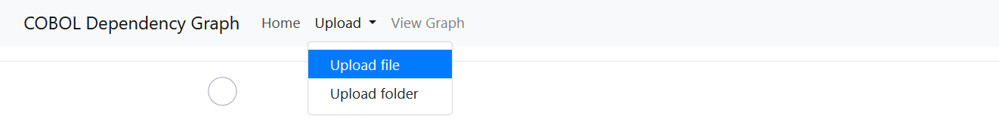
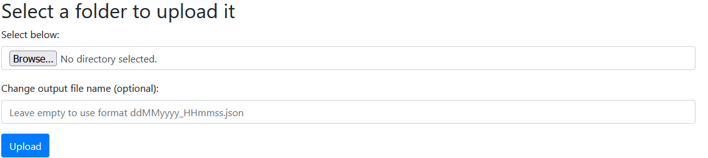

# COBOL Dependency Graph with ANTLR4 and Spring Boot

## Installing Maven
You don't need to install maven to start the project
[Maven download link](https://maven.apache.org/download.cgi)

## Run Program with Maven installed locally
1. Navigate to the root folder of the application
2. Open a shell in that directory
3. Write `mvn spring-boot:run`
4. Wait for the Spring Boot ASCII-Art to pop up
5. Open your browser and type `localhost:8080`
6. You are ready to use the tool

# Run Program with Maven not installed locally
1. Navigate to the root folder of the application
2. Open a shell in that directory
3. Write `mvnw spring-boot:run`
4. Wait for the Spring Boot ASCII-Art to pop up
5. Open your browser and type `localhost:8080`
6. You are ready to use the tool

## Navigation

### Upload

In the navigation of the site, `Upload` can be found. Clicking on this opens a menu to select either to upload one file or a whole folder.

#### File

When clicking on `Upload file`, a new page opens up where you can upload a file.

If you click on `Durchsuchen`, which would be `Browse` if your PC is set to English, you can browse one file on your local machine. When clicking on `Upload`, the file will be uploaded to the project where it will be parsed and visited by ANTLR.

#### Folder

When clicking on `Upload` folder, a new page opens up where you can upload a folder.

If you click on `Browse`, you can browse a folder on your local machine. When clicking on `Upload`, all files in the selected folder will be uploaded to the project where they will be parsed and visited by ANTLR.
### View Graph
In the navigation of the site, `View Graph` can be found. Clicking on this opens a new page.

#### Select Json
Select a JSON file and click on `Show Graph` to generate the dependency graph.

#### Enable or disable groups and nodes 

You can enable or disable whole groups or just specific nodes. 

Groups, for example, are all nodes that relate to a Copy Statement. If you disable Copy, then all Copy nodes won't be visible anymore:

The below expander gives the possibility to just disable certain nodes:

Clicking on `Update Graph` will adjust the graph.

#### Changeable graph 

##### Size
With `+` and `-` you can adjust the node size

##### Link Length
With `+` and `-` you can adjust the overall link length between nodes

##### Save svg:
With `Save as png` the current graph is saved as a png-file

##### Toggle Nodes Center Force

Sometimes if the graph is too big, nodes will fly out of the SVG where the graph is shown. To fix this, there is a checkbox to enable and disable that nodes will force to go to the center. It is enabled by default but can be changed by hitting the checkbox and clicking on `Update Graph` above.

#### Dependency Graph

Below is an example of a graph

#### Program files and other files 
Lastly, there is a section in which all uploaded files will be listed. By clicking on the expander, you can look inside the code of each program.

Program files are all files with a .cbl or .cob ending. Other files are all other files than with one of these endings, for example, copybooks or txt files.

## Dependency Graph supports the following
* Program
* Paragraph
* COPY
* CALL
* FILE-CONTROL and the corresponding Filename
* WORKING-STORAGE SECTION
* LOCAL-STORAGE SECTION
* FILE SECTION
* LINKAGE SECTION
* Information about RENAMES
* ADD
* SUBTRACT
* MULTIPLY
* DIVIDE
* IF + ADD, SUBTRACT, etc. is marked as within IF with an edge
* PERFORM
* GO TO
* SET
* EVALUATE + ADD, SUBTRACT, etc. is marked as within EVALUATE with an edge
* MOVE 
* ACCEPT